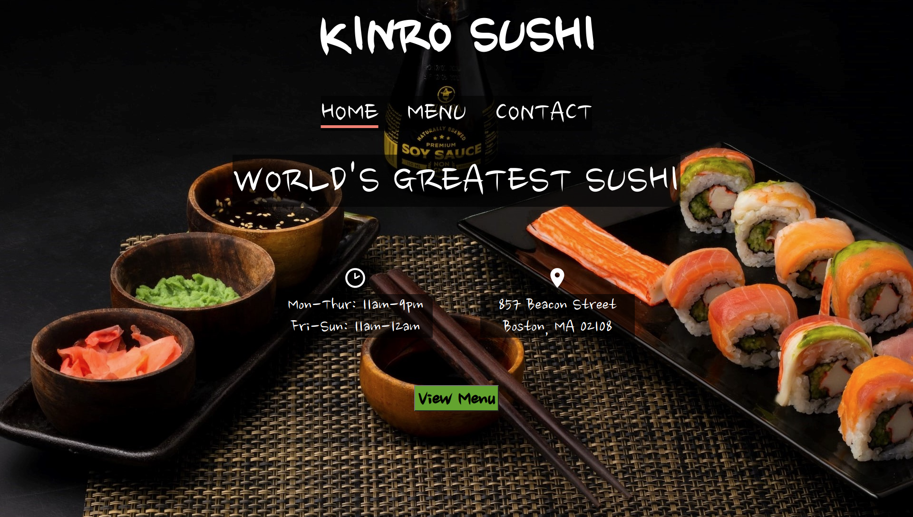
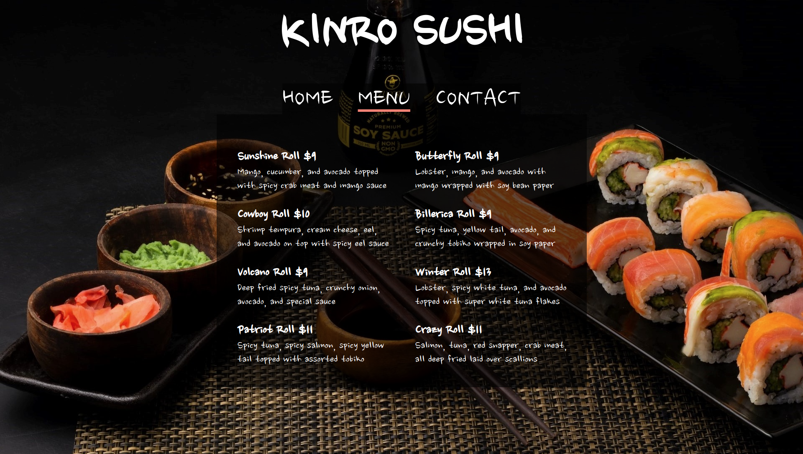
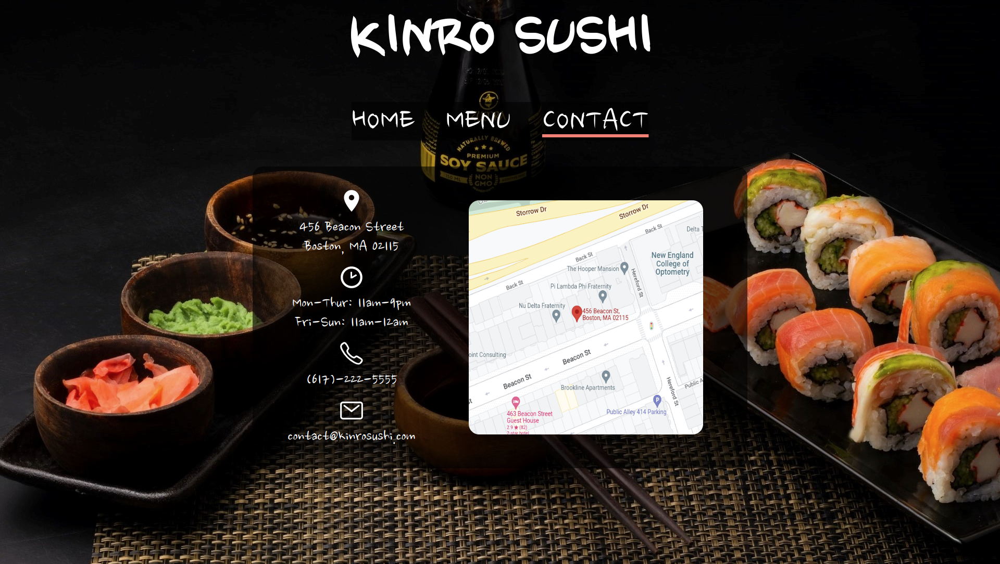

# Restaurant-Page

Project from [The Odin Project](https://www.theodinproject.com/)

## [Live Demo](https://gustav72.github.io/Restaurant-Page/)

### Technologies Used

JavaScript

HTML5

CSS3

Webpack

Babel

Node Package Manager

Git

### Overview

Welcome to my Library app! Input book data in the form and submit. Every book is made into an object and pushed into an array. The form is validated with JavaScript. Data is showcased in a table through DOM manipulation with JavaScript. Users can change read status by clicking 'yes' or 'no' in the finished column. Users can remove a book from the table by clicking the '✖'. Read status and removal status is updated in objects and the array as the user changes or removes data.

Background Photo by Mahmoud Fawzy on Unsplash

Thank You for taking the time to look at my work!
